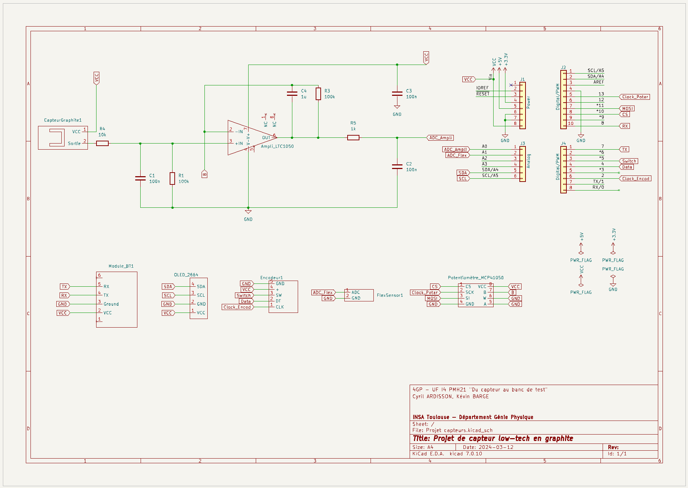

# 4GP 2023/2024 - Projet de capteur _low-tech_ en graphite - Par Cyril ARDISSON et Kévin BARGE  

## Table des matières
✓ [Contacts](#contacts)  
✓ [Contexte](#contexte)  
✓ [Livrables](#livrables)  
✓ [Matériel requis](#matériel-requis)  
[1- Simulation sous LTSpice](#1--simulation-sous-ltspice)  
[2- Design du PCB sous KiCAD](#2--design-du-pcb-sous-kicad)  
[3- Code sous Arduino IDE](#3--code-sous-arduino-ide)  
[4- Application Android](#4--application-android)  
[5- Réalisation du shield](#5--realisation-du-shield)  
[6- Banc de test et principaux résultats](#6--banc-de-test-et-principaux-resultats)  
[7- Datasheet du capteur](#7--datasheet-du-capteur)  
✓ [Conclusions et analyse critique du projet](#conclusions-et-analyse-critique-du-projet)  
___
## Contacts
Cyril ARDISSON : [ardisson@insa-toulouse.fr](mailto:ardisson@insa-toulouse.fr)  
Kévin BARGE : [barge@insa-toulouse.fr](mailto:barge@insa-toulouse.fr)  
___
## Contexte
Dans le cadre de l'UF de 4ème Année spécialité Génie Physique "Du capteur au banc de test" (I4GPMH21), nous avons réalisé l'évaluation d'une technologie low-tech : un capteur en graphite, composé de papier, recouvert d'une couche de graphite qu'on peut simplement trouver dans les crayons à papier ! En se déformant, le nombre de particules de graphite reliées varie, ce qui entraîne une modification de sa résistance. De cela, on peut donc induire la déformation. Sur le même principe qu'une jauge de contrainte (ici low-tech !). Ce travail se base sur les travaux de chercheurs de l'Université de Northwestern (Etats-Unis), publiés en 2014 dans l'article "_Pencil Drawn Strain Gauges and Chemiresistors on Paper_" (Cheng-Wei Lin, Zhibo Zhao, Jaemyung Kim & Jiaxing Huang). 

Afin de réaliser ce projet, plusieurs étapes ont été réalisées : simulation électronique, design de PCB et fabrication, programmation d'un Arduino Uno et d'une IHM, mise en place d'un banc de test et écriture d'une datasheet.

Ici, nous faisons le tour de tout ce qui a été fait dans le cadre de ce projet.

___
## Livrables
Plusieurs livrables sont attendus :

✓ **Le shield PCB connecté à une carte Arduino Uno**, composé : du capteur en graphite, d'un montage amplificateur transimpédance et d'un module Bluetooth. D'autres composants peuvent aussi être implémentés (*) : écran OLED, encodeur rotatoire, potentiomètre digital, flex sensor et connexions pour un servo-moteur ;  
✓ **Le code Arduino** permettant d'effectuer les mesures du capteur et de contrôler les composants implémentés ;  
✓ **L'APK Android** permettant d'interfacer le shield et le code Arduino correspondant : l'IHM en résumé ;  
✓ **Le / Les code(s) Arduino** permettant d'effectuer les tests du capteur ;  
✓ **La datasheet du capteur** reprenant toutes ses caractéristiques ainsi que ses tests.  

(*) Pour notre projet, nous avons décidés d'implémenter sur notre shield : l'écran OLED, l'encodeur rotatoire, le potentiomètre digital et le flex sensor. 
___
## Matériel requis
Afin de réaliser notre dispositif, nous avons eu besoin de :

Pour le montage amplificateur transimpédance :  
✓ Résistances : une de $1\ \text{k}\Omega$, une de $10\ \text{k}\Omega$ et deux de $100\ \text{k}\Omega$ - une troisième de $100\ \text{k}\Omega$ peut être prévue, mais peut aussi être substituée par une résistance variable (le potentiomètre digital), choix que l'on a fait ;  
✓ Un potentiomètre digital (si substitution d'une résistance de $100\ \text{k}\Omega$) : ici, choix du MCP41050 ;  
✓ Capacités : trois de $100\ \text{nF}$ et une de $1\ \mu\text{F}$ ;  
✓ Un amplificateur opérationnel : ici, choix du LTC1050 ;  

Pour le reste du dispositif :  
✓ Un module Bluetooth : ici, choix du HC05 ;  
✓ Un écran OLED de dimension 128*64 ;  
✓ Un encodeur rotatoire ;  
✓ Un flex sensor.
___
## 1- Simulation sous LTSpice
Notre capteur en graphite a une résistance de l'ordre du ${G}\Omega$, ce qui conduit, en appliquant une tension d'entrée de $5\ \text{V}$, à obtenir un courant de quelques ${nA}$. En conséquence, notre Arduino Uno ne pourra pas le lire. Il y a donc nécessité d'amplifier ce signal : c'est donc ce pourquoi nous mettons en place un **montage amplificateur transimpédance**.  

**_Description du montage amplificateur transimpédance_**  
Notre montage est composé de 4 zones importantes, une pour l'amplification et trois qui correspondent à des filtres :  
✓ Un premier filtre en entrée de l'amplificateur (${R1}$ et ${C1}$) : il correspond à un filtre passe-bas, qui permet de filtrer le bruit en courant sur le signal d'entrée ;  
✓ Un second filtre couplé à l'amplificateur (${R3}$ et ${C4}$) : il correspond aussi à un filtre passe-bas, qui permet de filtrer la composante 50 Hz du réseau électrique ;  
✓ et un troisième filtre en sorti de l'amplificateur (${R6}$ et ${C2}$) : pour filtrer le bruit lié au traitement opéré par l'amplificateur.  

Sur LTSpice, nous avons testé ce montage en deux temps.  

**_Simulations réalisées avec LTSpice_**  
Sur LTSpice, nous avons testé ce montage en deux temps.  

D'abord, nous avons effectué une première simulation pour vérifier si l'amplification était bien effective. Comme on peut le constater ci-dessous, le signal est bien amplifié à $1\ \text{V}$ : l'Arduino pourra donc l'interpréter.  

 

Enfin, nous avons effectué une seconde simulation, afin d'observer la réponse à un courant alternatif et ainsi de vérifier que le signal est bien filtré. Comme on peut aussi le constater ci-dessous, le signal paraît filtré, successivement par les 3 filtres.  

  
___
## 2- Design du PCB sous KiCAD
Ici, nous sommes repartis du montage décrit ci-dessus, avec quelques modifications et ajouts de composants. Nous avons utilisé le logiciel KiCad 7.0 :  
✓ Comme mentionné auparavant, nous avons remplacé ${R2}$ par le potentiomètre digital ;  
✓ Ajout d'un module Bluetooth afin d'assurer la communication entre le PCB et l'APK Android ;  
✓ Ajout d'un écran OLED afin d'afficher 3 menus différents ;  
✓ Ajout d'un encodeur rotatoire afin de passer de menu en menu ;  
✓ Et enfin, ajout d'un flex sensor, en vu des tests finaux.  

Pour se faire, nous avons débuté par la création de notre propre bibliothèque de symboles correspondant à nos composants. Puis, nous avons procédé à la création de la schématique électrique de l'ensemble du montage. L'image ci-dessous correspond à cette schématique.  

  

Puis, nous avons créé les empreintes de nos composants, en respectant certaines dimensions, en vu de l'impression du PCB (diamètre des trous, forme des empreintes, etc.). Nous sommes ensuite passés à la disposition des composants sur le PCB : une étape fastidieuse avec des compromis afin d'obtenir le placement le plus efficace (en considérant les connexions entre composants, en évitant d'avoir recours aux vias, etc.)... L'image ci-dessous correspond au résultat final de notre PCB, et sa vue en 3D correspondante :

  

Les fichiers KiCad sont disponibles dans le dossier [KiCad](https://github.com/MOSH-Insa-Toulouse/2023-2024-4GP-ARDISSON-BARGE/tree/main/KiCad). 
___
## 3- Code sous Arduino IDE
Le code de contrôle, qui permet d'effectuer les mesures du capteur et de contrôler les composants implémentés, a été développé sous Arduino IDE.  

...
___
## 4- Application Android
Nous avons créés une application en guise d'interface, avec MIT App Inventor.  

  

Cette application se veut simple et permet :  
✓ De se connecter au module Bluetooth du PCB afin de communiquer avec ce dernier ;  
✓ D'afficher sur un graphe la résistance du capteur en fonction du temps (où on peut démarrer / arrêter l'acquisition + effacer le graphe) ;  
✓ Et d'afficher la résistance "en direct".  

_Néanmoins, on rencontre tout de même quelques problèmes de connexion entre l'app qu'on installe sur un smartphone Android et le module Bluetooth. Bien souvent, aucune donnée n'est récupérée._  
___
## 5- Réalisation du shield
Fin mars, nous avons pu passer à la réalisation _physique_ de notre PCB. Voici les étapes de fabrication réalisées, avec l'aide de Cathy Crouzet (_merci !_) :  

Étape 0 (_importante !_) : vérification du PCB sous KiCad, notamment test DRC  
Étape 1 : édition du masque de gravure sous KiCad  
Étape 2 : insolation UV d'une plaquette d'époxy (recouverte d'une couche de cuivre et de résine photosensible)  
Étape 3 : immersion de la plaquette dans un révélateur afin d'éliminer la résine non-insolée  
Étape 4 : immersion de la plaquette dans du perchlorure de fer pour graver les pistes  
Étape 5 : nettoyage de la plaquette avec de l'acétone pour retirer la résine restante  
Étape 6 : perçage des trous et placement des composants sur le PCB  

L'image ci-dessous illustre le rendu final de notre PCB :  

  
___
## 6- Banc de test et principaux résultats
_Section en construction..._  
___
## 7- Datasheet du capteur
_Section en construction..._  
___
## Conclusions et analyse critique du projet
_Section en construction..._  

